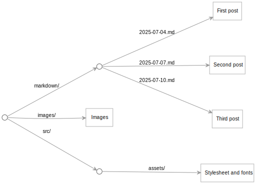
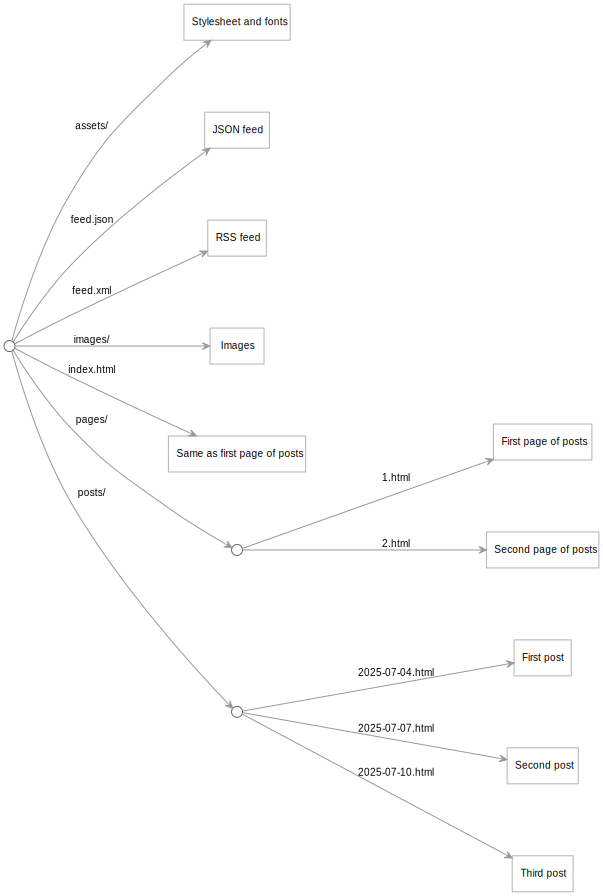

This is a simple blog site built in Python, exploring the representation of a site as a lazy tree of resources.

This demo applies concepts and operations from the [Web Origami](https://weborigami.org) project. No code from that project is actually used here.

[Live demo](https://pondlife-python.netlify.app)

## Installation

```console
$ python3 -m venv .venv
$ source .venv/bin/activate
$ pip install -e .[demo]
```

## Run the server locally

Start the server locally with:

```console
$ demo serve
```

This starts a server, e.g., on `127.0.0.1:8000`. The site is _lazy_: it only generates a resource when you ask for it.

## Build the static files

To build the static files:

```console
$ demo build
```

This creates an output folder `build`, then walks the entire site tree and writes all the resources to that folder.

## Architecture

The `src` folder is divided into parts:

- `map_origami`. A small library of reusable functions for working with lazy maps. These are based on functions in the original Web Origami [`Tree`](https://weborigami.org/builtin/tree) library. This library could theoretically be reused to create other sites, not just this blog.
- `blog_demo`: Uses the above library to create the sample blog.

The site's tree of resources is defined in [`src/blog_demo/site_tree.py`](./src/blog_demo/site_tree.py). The tree's interior nodes are `Mapping` instances; the leaf nodes are text files, images, and other web file types. The tree is used in two different ways:

1. The tree can be directly served, e.g., locally for development.
2. The tree can be copied to static files for deployment to a static file server.

The bulk of the site content is a set of posts defined in [`post_docs.py`](./src/blog_demo/post_docs.py). This treats the files in the `markdown` folder as a lazy map that is transformed in a series of operations to produce a final map with HTML fragments for each post, ready for rending via templates to create the final HTML pages.

## Structure of the site

The site's starting point are the markdown files in the `markdown` folder, the images in the `images` folder, and the stylesheet and other files in the `src/assets` folder.



The `site_tree.py` file orchestrates the transformation of that content into the final tree of resources for the site:



- A series of transformations turns each markdown post into an HTML page in the `posts` area.
- Posts are grouped into pages of 10 posts each in the `pages` area.
- The index page shows the same content as `pages/1.html`.
- Feeds are created for the posts in RSS and JSON Feed format.

## Processing markdown posts into data

The posts are written in markdown files with a `title` property in front matter. The file [`src/blog_demo/post_docs.py`](./src/blog_demo/post_docs.py) defines a short pipeline that transforms those files into a form that's ready for the templates to render as HTML.

The pipeline starts with a reference to the `markdown` Folder, representing it as a `MutableMapping` (a `Mapping` that can be updated) based on a file system folder. The keys of this mapping are the file names, and the values are the `bytes` on disk. For documentation purposes, if at this point we were to render the mapping as, say, YAML, it would look like:

```yaml
2025-07-04.md: [bytes]
2025-07-07.md: [bytes]
```

Each of the functions in the pipeline transforms this mapping — either the keys, or the values, or both — one step at a time.

The first transformation transforms the `bytes` to dictionaries with any front matter data as attributes, and a `_body` attribute containing the markdown text. Now the data looks like:

```yaml
2025-07-04.md:
  title: Hello from the pond!
  _body: "**Hey everyone!** Welcome to my very first blog post…"
2025-07-07.md:
  title: Tiny home
  _body: When I first decided to move off-grid…
… more posts …
```

The next step parses the file name to extract a `datetime`, which is added to the data as a `date` attribute:

```yaml
2025-07-04.md:
  title: Hello from the pond!
  _body: "**Hey everyone!** Welcome to my very first blog post…"
  date: Fri Jul 04 2025 12:00:00 GMT-05:00
2025-07-07.md:
  title: Tiny home
  _body: When I first decided to move off-grid…
  date: Fri Jul 07 2025 12:00:00 GMT-05:00
… more posts …
```

Then we transform the markdown `_body` to an HTML `_body`. We reflect this by also changing the keys from `.md` names to `.html` names:

```yaml
2025-07-04.html:
  title: Hello from the pond!
  _body: <strong>Hey everyone!</strong> Welcome to my very first blog post…
  date: Fri Jul 04 2025 12:00:00 GMT-05:00
2025-07-07.html:
  title: Tiny home
  _body: When I first decided to move off-grid…
  date: Fri Jul 07 2025 12:00:00 GMT-05:00
… more posts …
```

We'd like the page for an individual post to have links to the pages for the next and previous posts, so the next step in the pipeline adds `nextKey` and `previousKey` properties to the post data:

```yaml
2025-07-04.html:
  title: Hello from the pond!
  _body: <strong>Hey everyone!</strong> Welcome to my very first blog post…
  date: Fri Jul 04 2025 12:00:00 GMT-05:00
  nextKey: 2025-07-07.html
  previousKey: [None]
2025-07-07.html:
  title: Tiny home
  _body: When I first decided to move off-grid…
  date: Fri Jul 07 2025 12:00:00 GMT-05:00
  nextKey: 2025-07-10.html
  previousKey: 2025-07-04.html
… more posts …
```

Because the original markdown files have names that start with a date in YYYY-MM-DD format, by default the posts will be in chronological order. We'd like to display the posts in _reverse_ chronological order, so the final step of the pipeline reverses the keys of the mapping. The posts that were at the beginning will now be at the _end_ of the data:

```yaml
… more posts …
2025-07-07.html:
  title: Tiny home
  _body: When I first decided to move off-grid…
  date: Fri Jul 07 2025 12:00:00 GMT-05:00
  nextKey: 2025-07-10.html
  previousKey: 2025-07-04.html
2025-07-04.html:
  title: Hello from the pond!
  _body: <strong>Hey everyone!</strong> Welcome to my very first blog post…
  date: Fri Jul 04 2025 12:00:00 GMT-05:00
  nextKey: 2025-07-07.html
```

The markdown posts have now been transformed into a state that can be rendered by `site_tree.py` and the functions it calls.

In this demo, post data is transformed to final HTML using [Jinja](https://jinja.palletsprojects.com/) templates. That process is independent of other aspects of the site architecture; any other template system could be used instead.
